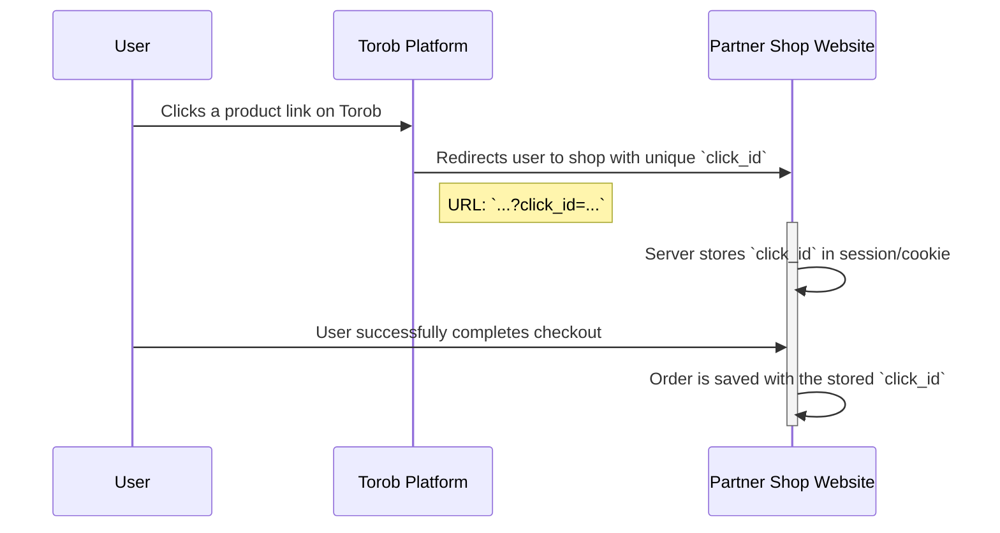
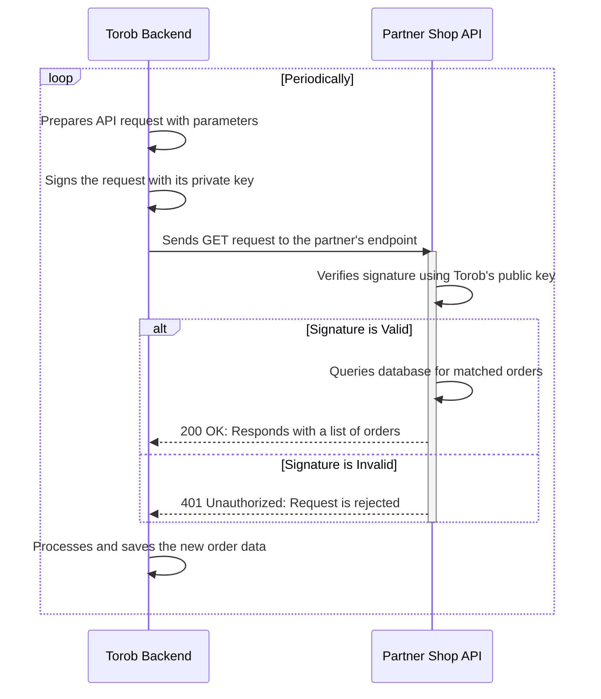

# [Draft] Order Tracking API: Implementation Guide for Partner Shops

**Specification for the `/torob/v1/orders` Endpoint**

## 0. Diagram

### Part 1: User Click & Order Attribution
This diagram shows how a user's click is tracked and associated with an order on the partner's website.



### Part 2: Backend Data Synchronization
This diagram shows how our backend system retrieves the order data from your API.



## 1. Introduction

This document outlines the technical requirements for implementing an order tracking system. To enable sales attribution and other features on our platform, partner shops can implement this secure API endpoint. It is designed to provide order data for users we refer to their site.

**Crucially, this endpoint must only expose order information for purchases that originated from our platform (i.e., orders that have an associated `click_id`).** This system allows for a transparent, performance-based partnership.

## 2. Workflow Overview

The order tracking process follows these steps:

1.  **User Redirection**: A user on our platform clicks a link to your website. We append a unique `click_id` as a query parameter in the URL.
    * *Example*: `https://www.yourshop.com/product/123?click_id=a1b2c3d4-e5f6-7890-g1h2-i3j4k5l6m7n8`

2.  **Capture `click_id`**: Your system must capture and store this `click_id` and associate it with the user's session.

3.  **Attribute Order**: When the user makes a purchase, the `click_id` must be saved along with the order details. Our attribution model covers the **entire shopping basket** for any purchase made within **24 hours** of the initial click.

4.  **Data Pull**: We will periodically call your API endpoint to retrieve new or updated order information.

## 3. API Implementation Requirements

You are required to create a secure, RESTful API endpoint that we can poll for order data. The data returned from this endpoint must be filtered to include **only orders placed by users we referred to your site**.

### 3.1. Endpoint & Authentication

* **URL**: You will need to provide us with a stable URL for your API endpoint. The path of this URL **must** end with `/torob/v1/orders`.
    * *Example Structure*: `https://api.yourshop.com/torob/v1/orders`
* **Method**: `GET`
* **Authentication**: Authentication is handled via a public/private key signature to ensure the integrity and authenticity of every request.
    1.  **Key Exchange**: We will provide you with our `Public Key` (RSA, 2048-bit). You must store this public key to verify incoming requests.
    2.  **Request Signing (Our Side)**: For each API call, we will create a unique signature by signing a string composed of the request timestamp and path with our private key.
    3.  **Signature Verification (Your Side)**: Your server must verify this signature using our public key.

#### Request Headers

Each request will include the following headers for authentication:

| Header        | Example                          | Description                                                                                                                           |
| :------------ | :------------------------------- | :------------------------------------------------------------------------------------------------------------------------------------ |
| `X-Timestamp` | `2025-09-21T10:00:00Z`           | The ISO 8601 timestamp of when the request was made, specified in UTC (indicated by the `Z` suffix). Requests with a timestamp older than 5 minutes should be rejected.                 |
| `X-Signature` | `(a long base64 encoded string)` | A Base64-encoded RSA-SHA256 signature.                                                                                                |

#### Signature Verification Logic

To verify a request, your server should perform the following steps:

1.  **Check Timestamp**: Ensure the `X-Timestamp` is current (e.g., within +/- 5 minutes of the server time) to prevent replay attacks.
2.  **Construct the String-to-Sign**: Concatenate the timestamp from the `X-Timestamp` header, a colon (`:`), and the full request path including query parameters.
    * **Format**: `{timestamp}:{request_path_and_query}`
    * **Example**: `2025-09-21T10:00:00Z:https://api.yourshop.com/torob/v1/orders?id_gt=10521&limit=100`
3.  **Verify Signature**: Use our public key to verify that the `X-Signature` (after Base64 decoding) is a valid RSA-SHA256 signature of the string you constructed in the previous step.
4.  If the signature is valid, process the request. Otherwise, respond with a `401 Unauthorized` error.

### 3.2. Request Parameters

We will poll your endpoint for new or updated records since our last request. Your endpoint must support filtering by an incrementing order `id`.

| Parameter | Type    | Required | Description                                                                                                    |
| :-------- | :------ | :------- | :------------------------------------------------------------------------------------------------------------- |
| `id_gt`  | Integer | Yes      | "Greater Than". Returns all orders from your platform with an ID greater than the specified value.          |
| `limit`   | Integer | Yes      | The maximum number of records to return. The value must be greater than 0 and less than or equal to `1000`. |

* *Example Request*: `GET https://api.yourshop.com/torob/v1/orders?id_gt=10521&limit=100`

### 3.3. Response Format

The response must be a JSON object with the `Content-Type` header set to `application/json`. The records must be sorted in ascending order by their `id`.

#### Success Response (`200 OK`)

```json
{
  "success": true,
  "data": [
    {
      "id": 10522,
      "click_id": "a1b2c3d4-e5f6-7890-g1h2-i3j4k5l6m7n8",
      "order_value": 5000000,
      "postage_fee": 900000,
      "status": "completed",
      "purchase_timestamp": "2025-09-21T10:00:00Z",
      "last_updated_timestamp": "2025-09-21T10:05:00Z",
      "products": [
        {
          "product_url": "https://www.yourshop.com/product/789",
          "product_price": 1000000,
          "quantity": 1,
        },
        {
          "product_url": "https://www.yourshop.com/product/123",
          "product_price": 2000000,
          "quantity": 2,
        }
      ]
    }
  ]
}
```

#### No New Orders Response (`200 OK`)

If there are no new orders matching the query, return an empty `data` array.

```json
{
  "success": true,
  "data": []
}
```

### 3.4. Response Field Details

**Note**: All timestamps must be provided in the ISO 8601 format and specified in the **UTC timezone**, indicated by a `Z` suffix (e.g., `2025-09-21T10:00:00Z`).

| Field                  | Type    | Description                                                                                                                                                             |
| :--------------------- | :------ | :---------------------------------------------------------------------------------------------------------------------------------------------------------------------- |
| `id`                   | Integer | **Required.** Your unique, auto-incrementing identifier for the order record.                                                                                           |
| `click_id`             | String  | **Required.** The unique click identifier passed to you on user redirection.                                                                                            |
| `order_value`          | Int64   | **Required.** The total value of all items in the order, excluding postage fees and taxes, but after any discounts have been applied.                                     |
| `postage_fee`          | Int64   | **Required.** The shipping and handling cost for the order.                                                                                                             |
| `status`               | String  | **Required.** The current status of the order. Must be one of `completed` or `cancelled`.                                                                               |
| `purchase_timestamp`   | String  | **Required.** The ISO 8601 timestamp (UTC) of when the order was initially placed.                                                                                            |
| `last_updated_timestamp` | String  | **Required.** The ISO 8601 timestamp (UTC) of when the order was last modified. For new orders, this can be the same as `purchase_timestamp`.         |
| `products`             | Array   | **Required.** An array of objects, where each object represents an item in the order.                                                                                   |
| `products.product_url` | String  | **Required.** A direct link to the product page on your website.                                                                                                         |
| `products.price`       | Int64   | **Required.** The price of a single unit of the product.                                                                                                                |
| `products.quantity`    | Integer | **Required.** The number of units of this product purchased.                                                                                                            |

## 4. Order Cancellations & Updates

To account for cancelled orders, you must provide updates for up to **7 days** after the initial purchase.

* When an order is cancelled, update its `status` to `cancelled` and update its `last_updated_timestamp`.
* Our polling system will retrieve these updated records periodically.
