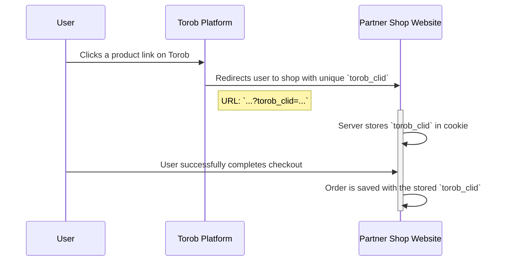
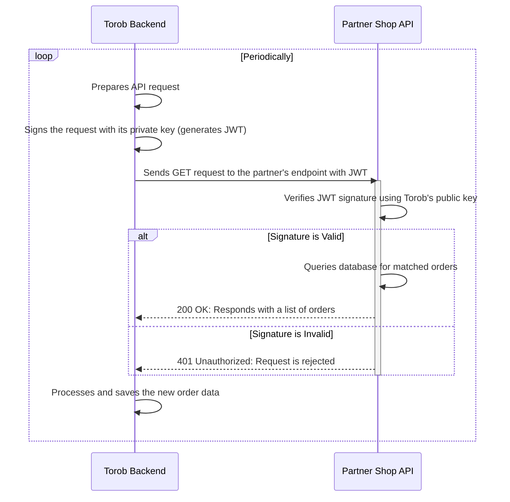

# Order Tracking API: Implementation Guide for Partner Shops
## Specification for the `/torob/v1/orders` Endpoint

## 0. Diagram

### Part 1: User Click & Order Attribution
This diagram shows how a user's click is tracked and associated with an order on the partner's website.



### Part 2: Backend Data Synchronization
This diagram shows how our backend system retrieves the order data from your API.



## 1. Introduction
This document outlines the technical requirements for implementing an order tracking system. To enable sales attribution and other features on our platform, partner shops can implement this secure API endpoint. It is designed to provide order data for users we refer to their site.

Crucially, this endpoint must only expose order information for purchases that originated from our platform (i.e., orders that have an associated `torob_clid`). This system allows for a transparent, performance-based partnership.

## Workflow Overview
The order tracking process follows these steps:

1.  **User Redirection**: A user on our platform clicks a link to your website. We append a unique torob click id `torob_clid` as a query parameter in the URL.
    *   **Example**: `https://www.yourshop.com/product/123?torob_clid=a1b2c3d4-e5f6-7890-g1h2-i3j4k5l6m7n8`

2.  **Capture torob_clid**: Your system must capture and store this `torob_clid` and associate it with the user's cookie.

3.  **Attribute Order**: When the user makes a purchase, the `torob_clid` must be saved along with the order details. Our attribution model covers the entire shopping basket for any purchase made within 7 days (168 hours) of the initial click.

4.  **Data Pull**: We will periodically call your API endpoint to retrieve new or updated order information.

## API Implementation Requirements
You are required to create a secure, RESTful API endpoint that we can poll for order data. The data returned from this endpoint must be filtered to include only orders placed by users we referred to your site.

### 3.1. Endpoint & Authentication
- **URL**: You will need to provide us with a stable URL for your API endpoint.
  - **URL Structure**: Your endpoint must follow the structure `https://[your_api_hostname]/[optional_path]/torob/v1/orders`, which is composed of the following parts:
    - `[your_api_hostname]`: The domain or subdomain of your API (e.g., `api.yourshop.com`).
    - `[optional_path]`: An optional base path if your architecture requires it (e.g., `/api/integrations/`). If not needed, this can be omitted.
    - `/torob/v1/orders`: The required path for the endpoint. The URL you provide **must** end with this path. This ensures consistency across all partner integrations.
  - **Example URLs**:
    - **Simple Structure**: `https://api.yourshop.com/torob/v1/orders`
    - **Structure with Optional Path**: `https://yourshop.com/api/torob/v1/orders`
- **Method**: `GET`
- **Authentication**: All requests to your endpoint will be authenticated using a JSON Web Token (JWT). By validating this token, you can ensure that the request originates from Torob and prevent unauthorized access. The token is signed using the EdDSA (ed25519) algorithm.

#### Torob Public Key
You must use the following public key to validate the signature of the JWT included in each request.
```pem
-----BEGIN PUBLIC KEY-----
MCowBQYDK2VwAyEAt6Mu4T0pBORY11W+QeM35UsmLO3vsf+6yKpFDEImFk0=
-----END PUBLIC KEY-----
```

#### Request Headers
Each request will include the following headers for authentication:

| Header                  | Example                            | Description                                                            |
| ----------------------- | ---------------------------------- | ---------------------------------------------------------------------- |
| `X-Torob-Token`         | (a long base64 encoded JWT string) | The JWT used for authentication. Your server must validate this token. |
| `X-Torob-Token-Version` | `1`                                | The version of the token authentication scheme being used.             |

#### JWT Validation Logic
The JWT payload contains several important claims you must validate:

**Sample Decoded JWT:**
```json
{
  "header": {"alg": "EdDSA", "typ": "JWT", "v": 1},
  "payload": {"aud": "api.yourshop.com", "exp": 1730206744, "nbf":  1730206000}
}
```

**Claim Details:**

*   `exp` **(Expiration Time)**: A Unix epoch timestamp (in seconds). Your server must reject any request where the current time is past this timestamp.
*   `nbf` **(Not Before)**: A Unix epoch timestamp (in seconds). Your server must reject any request where the current time is before this timestamp.
*   `aud` **(Audience)**: This value must exactly match the `Host` header of the request (e.g., `api.yourshop.com` or `api.yourshop.com:8080`). This check is critical to ensure that a token generated for one partner cannot be used for another.

Many standard JWT libraries automatically validate the `exp` and `nbf` claims, but you must ensure the `aud` claim is also verified against your API's hostname.

> **Note on Server Time**: Correct server time synchronization is crucial. If your server's clock is inaccurate, it may incorrectly reject valid tokens.

### 3.2. Request Parameters
We will poll your endpoint for new or updated records since our last request. Your endpoint must support filtering by an incrementing order id.

| Parameter               | Type    | Required | Description                                                                                    |
| ----------------------- | ------- | -------- | ---------------------------------------------------------------------------------------------- |
| `purchase_timestamp_gt` | String  | Yes      | "Greater Than". Returns all orders from your platform with a purchase_timestamp greater than the specified value. The value must be in ISO 8061 format (UTC). |
| `limit`                 | Integer | Yes      | The maximum number of records to return. The value must be greater than 0 and less than or equal to 1000. |

**Example Request**: `GET https://api.yourshop.com/torob/v1/orders?purchase_timestamp_gt=2025-09-21T10:00:00.000000Z&limit=1000`

### 3.3. Response Format
The response must be a JSON object with the `Content-Type` header set to `application/json`. The records must be sorted in ascending order by their `purchase_timestamp`.

#### Success Response (200 OK)
```json
{
  "success": true,
  "data": [
    {
      "purchase_timestamp": "2025-09-21T10:20:30.456789Z",
      "torob_clid": "a1b2c3d4-e5f6-7890-g1h2-i3j4k5l6m7n8",
      "order_value": 500000,
      "shipping_amount": 90000,
      "status": "completed",
      "last_updated_timestamp": "2025-09-21T10:20:30.456789Z",
      "phone_number": "+989123456789",
      "products": [
        {
          "product_url": "https://www.yourshop.com/product/789",
          "product_price": 100000,
          "quantity": 1
        },
        {
          "product_url": "https://www.yourshop.com/product/123",
          "product_price": 200000,
          "quantity": 2
        }
      ]
    }
  ]
}
```

#### No New Orders Response (200 OK)
If there are no new orders matching the query, return an empty `data` array.
```json
{
  "success": true,
  "data": []
}
```

### 3.4. Response Field Details
> **Note**: All timestamps must be provided in the ISO 8601 format and specified in the UTC timezone, indicated by a `Z` suffix (e.g., `2025-09-21T10:20:30.456789Z`).

> **Note**: All monetary fields (`order_value`, `shipping_amount`, `products.product_price`) must be provided as integers in Toman.

| Field                    | Type    | Required | Description |
| ------------------------ | ------- | -------- | ----------- |
| `purchase_timestamp`     | String  | Required | The ISO 8601 timestamp (UTC) of when the order was initially placed. |
| `torob_clid`              | String  | Required | The unique tracking identifier passed to you on user redirection. |
| `order_value`            | Integer | Required | The total value of all items in the order, as an integer in Toman, excluding postage fees and taxes, but after any discounts have been applied. |
| `shipping_amount`        | Integer | Required | The shipping and handling cost for the order, as an integer in Toman. |
| `status`                 | String  | Required | The current status of the order. Must be one of `completed` or `cancelled`. |
| `last_updated_timestamp` | String  | Required | The ISO 8601 timestamp (UTC) of when the order was last modified. For new orders, this can be the same as `purchase_timestamp`. |
| `phone_number`           | String  | Required | User's phone number. |
| `products`               | Array   | Required | An array of objects, where each object represents an item in the order. |
| `products.product_url`   | String  | Required | A direct link to the product page on your website. |
| `products.product_price` | Integer | Required | The price of a single unit of the product, as an integer in Toman. |
| `products.quantity`      | Integer | Required | The number of units of this product purchased. |

## 4. Order Cancellations & Updates
To account for cancelled orders, you must provide updates for up to 7 days after the initial purchase.

When an order is cancelled, update its `status` to `cancelled` and update its `last_updated_timestamp`.

Our polling system will retrieve these updated records periodically.

## 5. Appendix: Code Samples for JWT Validation
The following samples demonstrate how to validate the `X-Torob-Token` JWT in various programming languages.

### Python
This example uses the `pyjwt[crypto]` library.
```python
import jwt

PUBLIC_KEY = f"""
-----BEGIN PUBLIC KEY-----
MCowBQYDK2VwAyEAt6Mu4T0pBORY11W+QeM35UsmLO3vsf+6yKpFDEImFk0=
-----END PUBLIC KEY-----
"""

def validate_token(token: str):
    # exp and aud fields are checked by PyJWT library.
    jwt.decode(token, key=PUBLIC_KEY, algorithms=["EdDSA"], audience="[expected_aud_value]")
```

### Go
This example uses the `github.com/golang-jwt/jwt/v5` library.
```go
package main

import (
	"crypto"
	"fmt"
	"github.com/golang-jwt/jwt/v5"
	"log"
)

func verify(token string, parser *jwt.Parser, key crypto.PublicKey) (*jwt.Token, error) {
	parsedToken, err := parser.ParseWithClaims(token, &jwt.MapClaims{}, func(token *jwt.Token) (interface{}, error) {
		return key, nil
	})
	if err != nil {
		return nil, fmt.Errorf("unable to parse token: %v", err)
	}
	return parsedToken, nil
}

func main() {
	publicKey := []byte(`-----BEGIN PUBLIC KEY-----
MCowBQYDK2VwAyEAt6Mu4T0pBORY11W+QeM35UsmLO3vsf+6yKpFDEImFk0=
-----END PUBLIC KEY-----`)
	publicKeyPem, err := jwt.ParseEdPublicKeyFromPEM(publicKey)
	if err != nil {
		log.Fatal(err)
	}
	// aud and exp fields are checked by jwt library
	parser := jwt.NewParser(jwt.WithAudience("[expected_aud_value]"), jwt.WithExpirationRequired(), jwt.WithValidMethods([]string{"EdDSA"}))
	// parser and publicKeyPem are constant and should be computed only once in your code.
    // token is the JWT token received from the client.
	token := "..."

	if _, err = verify(token, parser, publicKeyPem); err != nil {
		log.Fatal(err)
	}
}
```

### Java
This example uses the `io.jsonwebtoken:jjwt` library.
```java
import io.jsonwebtoken.*;
import io.jsonwebtoken.io.Decoders;
import java.security.*;
import java.security.spec.*;


public class JwtVerifier {
    private final JwtParser parser;

    public JwtVerifier() throws NoSuchAlgorithmException, InvalidKeySpecException {
        final var publicKeyString = "MCowBQYDK2VwAyEAt6Mu4T0pBORY11W+QeM35UsmLO3vsf+6yKpFDEImFk0=";
        KeySpec keySpec = new X509EncodedKeySpec(Decoders.BASE64.decode(publicKeyString));
        PublicKey publicKey = KeyFactory.getInstance("EdDSA").generatePublic(keySpec);
        // aud and exp fields are checked by library.
        parser = Jwts.parser().requireAudience("[expected_aud_value]").verifyWith(publicKey).build();
    }

    public Jws<Claims> verifyToken(String token) {
        return parser.parseSignedClaims(token);
    }
}
```

### PHP
This example uses the `firebase/php-jwt` library.
```php
use Firebase\JWT\JWT;
use Firebase\JWT\Key;

define('TOROB_PUBLIC_KEY','MCowBQYDK2VwAyEAt6Mu4T0pBORY11W+QeM35UsmLO3vsf+6yKpFDEImFk0=');
define('TOROB_PUBLIC_KEY_SEED',base64_encode(substr(base64_decode(TOROB_PUBLIC_KEY), -32)));

function verify($jwt): object {
    // exp is checked by library but we should check aud manually.
    $decoded = JWT::decode($jwt, new Key(TOROB_PUBLIC_KEY_SEED, 'EdDSA'));
    if ($decoded->aud !== "[expected_aud_value]") {
        throw new \Exception("Invalid audience");
    }
    return $decoded;
}
```
