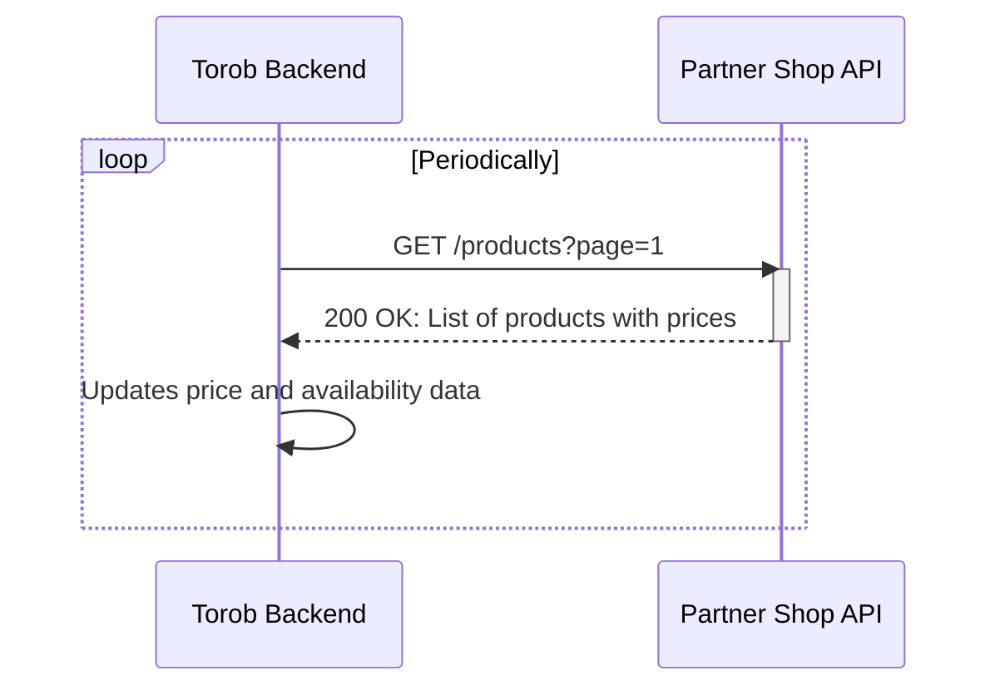

# Product API v1: Price and Availability Updates (Deprecated)
## Quick Price and Availability Sync Endpoint

> **Note**: This API version is deprecated. Please use [Product API v3](product_api_v3.md) for new integrations.

## 0. Diagram



## 1. Introduction

This document outlines the technical requirements for implementing a simple product price and availability sync API. Partners can provide an API endpoint or page containing product information to enable faster price and availability updates on Torob.

## 2. API Implementation Requirements

### 2.1. Endpoint Specification

- **Method**: `GET`
- **Pagination**: Required - each page must contain at least 100 products
- **Sorting**: Products should be sorted from newest to oldest (recently added/updated products first)

### 2.2. Response Format

The response must be a JSON array containing product objects with the following fields:

```json
[
  {
    "product_id": "12345",
    "page_url": "https://www.yourshop.com/product/12345",
    "price": 5000000,
    "availability": "instock",
    "old_price": 5500000
  }
]
```

### 2.3. Response Field Details

| Field          | Type    | Required | Description |
| -------------- | ------- | -------- | ----------- |
| `product_id`   | String  | Required | A unique identifier for the product. This ID is used to identify products in Torob's search engine. It must be unique per product and remain constant over time. |
| `page_url`     | String  | Required | The direct URL to the product page on your website. |
| `price`        | Integer | Required | The current selling price in Toman. For discounted products, this should be the price after discount. |
| `availability` | String  | Required | Product availability status. Use `instock` to indicate the product is available. |
| `old_price`    | Integer | Optional | The original price before discount (for discounted products only). |

## 3. Important Notes

1. **Product ID Consistency**: The `product_id` must remain constant for each product. Changing the ID will result in the product becoming inaccessible on Torob.

2. **Price Accuracy**: The `price` field should reflect the actual selling price on your website. For discounted items, use the discounted price.

3. **Data Consistency**: Information in this API must match the information displayed on the actual product page.

4. **Pagination Support**: Your endpoint must support pagination with a `page` query parameter.

5. **Sorting Order**: Products should be sorted with recently added or updated products first.
