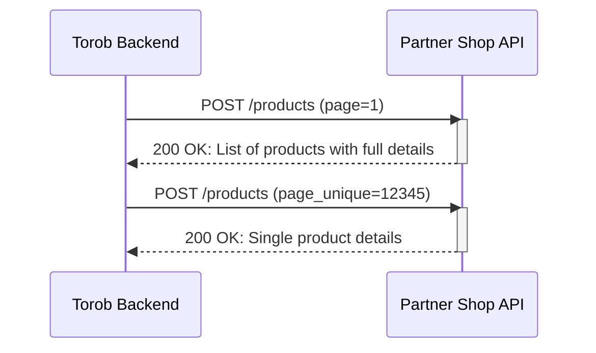

# Product API v2: Add and Update Products (Deprecated)
## Full Product Information Sync Endpoint

> **Note**: This API version is deprecated. Please use [Product API v3](product_api_v3.md) for new integrations.

> **Important**: Only implement this API if specifically requested by Torob support. For most cases, API v1 is sufficient. Implementing this API provides no additional benefits unless requested.

## 0. Diagram



## 1. Introduction

This document outlines the technical requirements for implementing a product sync API that supports both adding new products and updating existing product information on Torob.

## 2. API Implementation Requirements

### 2.1. Endpoint Specification

- **Method**: `POST`
- **URL Structure**: `https://[your_domain]/[optional_path]/products`
  - The URL must end with `/products`
- **Content-Type**: `application/x-www-form-urlencoded` (form-data)

### 2.2. Request Parameters

Parameters are sent as form-data:

| Parameter     | Type   | Description |
| ------------- | ------ | ----------- |
| `page_unique` | String | Product unique identifier (for single product lookup) |
| `page_url`    | String | Product URL (for single product lookup) |
| `page`        | Integer | Page number for pagination (defaults to 1 if not provided) |

**Request Modes:**
- If no parameters are sent (or only `page`): Returns paginated list of all products
- If `page_unique` or `page_url` is sent: Returns the specific product

### 2.3. Response Format

```json
{
  "count": 150,
  "max_pages": 2,
  "products": [
    {
      "title": "Xiaomi Mi Note 10 Pro",
      "subtitle": "گوشی موبایل شائومی Note 10 Pro",
      "page_unique": "12412",
      "current_price": 5000000,
      "old_price": 5500000,
      "availability": "instock",
      "category_name": "mobile",
      "image_link": "https://domain.com/images/main.jpg",
      "image_links": [
        "https://domain.com/images/main.jpg",
        "https://domain.com/images/gallery-1.jpg"
      ],
      "page_url": "https://domain.com/product/34/",
      "short_desc": "With face detection sensor",
      "spec": {
        "memory": "4GB",
        "camera": "12 Megapixels",
        "color": "White"
      },
      "registry": "Registered",
      "guarantee": "24 months warranty"
    }
  ]
}
```

### 2.4. Response Field Details

| Field           | Type   | Required | Description |
| --------------- | ------ | -------- | ----------- |
| `count`         | Integer | Required | Total number of products |
| `max_pages`     | Integer | Required | Total number of pages (100 products per page) |
| `title`         | String | Required | Product title (max 500 characters) |
| `subtitle`      | String | Optional | Product subtitle, usually English name (max 500 characters) |
| `page_unique`   | String | Required | Unique, non-repeating product identifier |
| `current_price` | Integer | Required | Current selling price in Toman |
| `old_price`     | Integer | Optional | Original price before discount |
| `availability`  | String | Required | Use `instock` for available products |
| `category_name` | String | Optional | Product category |
| `image_link`    | String | Required | Main product image URL (max 1000 characters) |
| `image_links`   | Array  | Required | List of all product image URLs (including main image) |
| `page_url`      | String | Required | Product page URL |
| `short_desc`    | String | Optional | Brief product description |
| `spec`          | Object | Optional | Key-value pairs of product specifications |
| `registry`      | String | Optional | For mobile phones only: "Registered" or "Not Registered" |
| `guarantee`     | String | Optional | Product warranty information |

## 3. Important Notes

1. **Sorting**: Products should be sorted from newest to oldest (recently added/updated first).

2. **Optional Fields**: Optional fields are not required, but omitting them may delay product approval and categorization.

3. **Pagination**: Each page must contain 100 products.

4. **Registry Field**: Only applicable for mobile phone products.

5. **Single Product Request**: When `page_url` or `page_unique` is provided, return a list containing only that single product.

6. **URL Parameters**: Your endpoint should handle additional URL parameters (like UTM tags) gracefully. For example:
   - `https://domain.com/product/example?utm_medium=PPC&utm_source=Torob` should work the same as the base URL.

7. **Character Limits**:
   - Title and subtitle: 500 characters max
   - Image links: 1000 characters max
