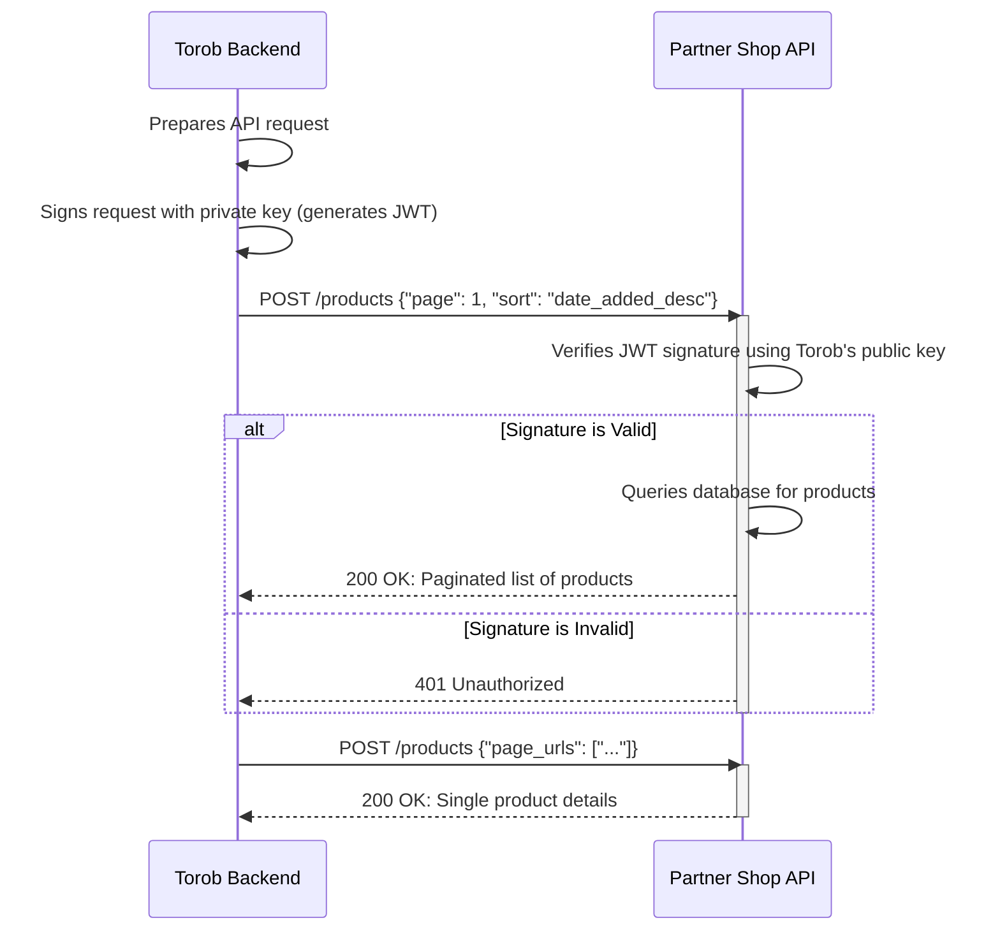

# Product API v3: Implementation Guide for Partner Shops
## Specification for the Product Sync Endpoint

## 0. Diagram



## 1. Introduction

This document outlines the technical requirements for implementing the TorobAPI v3 product sync endpoint. Torob uses this endpoint in two ways:

1. **Fetching all products**: With pagination and sorting
2. **Fetching specific products**: By URL or unique identifier

## 2. API Implementation Requirements

### 2.1. Endpoint Specification

- **Method**: `POST`
- **Content-Type**: `application/json`
- **Authentication**: JWT token validation (see [Token Guide](torob_api_token_guide.md))

### 2.2. Request Parameters

The request body is JSON and will be **one of** the following formats:

#### Option 1: Fetch products by URLs
```json
{"page_urls": ["https://domain.com/product/34/", "https://domain.com/product/35/"]}
```

#### Option 2: Fetch products by unique identifiers
```json
{"page_uniques": ["12412_1", "12412_2", "12412_3"]}
```

#### Option 3: Fetch paginated product list
```json
{"page": 1, "sort": "date_added_desc"}
```

**Parameter Details:**

| Parameter      | Type         | Description |
| -------------- | ------------ | ----------- |
| `page_urls`    | list[string] | List of product URLs (minimum 1 item) |
| `page_uniques` | list[string] | List of unique product identifiers (minimum 1 item) |
| `page`         | integer      | Page number (starts from 1) |
| `sort`         | string       | Sorting method: `date_added_desc` or `date_updated_desc` |

**Sort Options:**
- `date_added_desc`: Sort by date added (newest first) - Required for all shops
- `date_updated_desc`: Sort by date updated (newest first) - Required only for large shops and shop builders

> **Important**: Do not set default values for parameters. If the request body is empty or has invalid parameters, return a 400 error.

### 2.3. Response Format

```json
{
  "api_version": "torob_api_v3",
  "current_page": 1,
  "total": 150,
  "max_pages": 2,
  "products": [
    {
      "page_unique": "12412_1",
      "page_url": "https://domain.com/product/34/",
      "product_group_id": "12412",
      "title": "Xiaomi Mi Note 10 Pro",
      "subtitle": "گوشی موبایل شائومی Note 10 Pro",
      "current_price": 5000000,
      "old_price": 5500000,
      "availability": true,
      "category_name": "mobile",
      "image_links": [
        "https://domain.com/images/main.jpg",
        "https://domain.com/images/gallery-1.jpg"
      ],
      "spec": {
        "memory": "4GB",
        "camera": "12 Megapixels",
        "color": "White"
      },
      "guarantee": "24 months warranty",
      "short_desc": "With face detection sensor",
      "date_added": "2024-11-22T01:15:12+03:30",
      "date_updated": "2024-11-29T20:15:12+03:30"
    }
  ]
}
```

### 2.4. Response Field Details

| Field              | Type           | Required | Description |
| ------------------ | -------------- | -------- | ----------- |
| `api_version`      | string         | Required | Must be `"torob_api_v3"` |
| `current_page`     | integer        | Required | Current page number |
| `total`            | integer        | Required | Total number of products |
| `max_pages`        | integer        | Required | Total pages (100 products per page) |
| `page_unique`      | string         | Required | Unique product identifier (max 200 chars). Must remain constant. |
| `page_url`         | string         | Required | Absolute URL to product page (max 1500 chars) |
| `product_group_id` | string         | Optional | Groups product variants (e.g., different colors) (max 200 chars) |
| `title`            | string         | Required | Product title (max 500 chars) |
| `subtitle`         | string         | Optional | Product subtitle (max 500 chars) |
| `current_price`    | integer        | Required | Selling price in Toman. Must be integer, never null. Use 0 for unavailable products. |
| `old_price`        | integer        | Optional | Original price before discount |
| `availability`     | boolean        | Required | Product availability status |
| `category_name`    | string         | Optional | Product category (max 200 chars) |
| `image_links`      | list[string]   | Required | Product images (first must be main image, each max 1000 chars) |
| `short_desc`       | string         | Optional | Brief description (max 500 chars) |
| `spec`             | dict           | Optional | Key-value pairs of specifications |
| `guarantee`        | string         | Optional | Warranty information (max 200 chars) |
| `date_added`       | string         | Required | ISO 8601 timestamp with timezone |
| `date_updated`     | string         | Optional | ISO 8601 timestamp with timezone (required if implementing `date_updated_desc` sort) |
| `seller_name`      | string         | Optional | Seller name (marketplaces only) |
| `seller_city`      | string         | Optional | Seller city (marketplaces only) |

### 2.5. Error Response Format

For invalid requests, return status code `400` with:

```json
{
  "error": "sort parameter is not provided"
}
```

## 3. Authentication

All requests include a JWT token for authentication. See the [Token Guide](torob_api_token_guide.md) for implementation details.

**Request Headers:**

| Header                  | Description |
| ----------------------- | ----------- |
| `X-Torob-Token`         | JWT token for authentication |
| `X-Torob-Token-Version` | Token version (currently `1`) |

## 4. Important Notes

1. **Pagination**: Pages start from 1. Each page (except the last) must contain exactly 100 products.

2. **Free Products**: If `availability` is `true` and `current_price` is `0`, the product is displayed as free.

3. **Absolute URLs**: All URLs must be absolute. Relative URLs are not accepted.
   - Valid: `https://www.example.com/product/1/`
   - Invalid: `/product/1/`

4. **Removed Products**: If a product is deleted or should no longer be shown on Torob, exclude it from the product list. For single-product requests, return an empty products array.

5. **Image Quality**: Images should be at least 900x900 pixels. Images below 600x600 will not be displayed.

6. **Thumbnails**: Do not use thumbnail images. The first image must be the main product image.

7. **Product Variants**: For different variants (colors, sizes), use the same `product_group_id` but different `page_unique` values.

## 5. Example Requests

### Fetching Page 2 of Products

**Request:**
```bash
curl --header "Content-Type: application/json" \
     --header "Accept: application/json" \
     --header "X-Torob-Token: [JWT]" \
     --header "X-Torob-Token-Version: 1" \
     --request POST \
     --data '{"page": 2, "sort": "date_added_desc"}' \
     'https://example.com/torob_api/v3/products'
```

**Response:**
```json
{
  "api_version": "torob_api_v3",
  "current_page": 2,
  "total": 150,
  "max_pages": 2,
  "products": [...]
}
```

### Fetching a Single Product

**Request:**
```json
{"page_urls": ["https://domain.com/product/34/"]}
```
or
```json
{"page_uniques": ["12412_1"]}
```

**Response:**
```json
{
  "api_version": "torob_api_v3",
  "current_page": 1,
  "total": 1,
  "max_pages": 1,
  "products": [
    {
      "page_unique": "12412_1",
      "page_url": "https://domain.com/product/34/",
      ...
    }
  ]
}
```

### Deleted/Hidden Product Response

**Request:**
```json
{"page_uniques": ["12412_1"]}
```

**Response:**
```json
{
  "api_version": "torob_api_v3",
  "current_page": 1,
  "total": 0,
  "max_pages": 1,
  "products": []
}
```

### Error Response

**Request:**
```json
{"page": 1}
```

**Response (400 Bad Request):**
```json
{
  "error": "sort parameter is not provided"
}
```

## 6. Appendix: Data Schema

```python
class Result:
    api_version: str
    current_page: int
    total: int
    max_pages: int
    products: list[Product]

class Product:
    page_unique: str         # max_len=200
    page_url: str            # max_len=1500
    title: str               # max_len=500
    subtitle: Optional[str]  # max_len=500
    product_group_id: Optional[str]  # max_len=200
    current_price: int
    old_price: Optional[int]
    availability: bool
    category_name: Optional[str]  # max_len=200
    image_links: list[str]   # link max_len=1000
    short_desc: Optional[str]  # max_len=500
    spec: dict[str, str | int]
    guarantee: Optional[str]  # max_len=200
    date_added: str          # timezone-aware ISO 8601
    date_updated: Optional[str]  # timezone-aware ISO 8601
    seller_name: Optional[str]
    seller_city: Optional[str]
```
