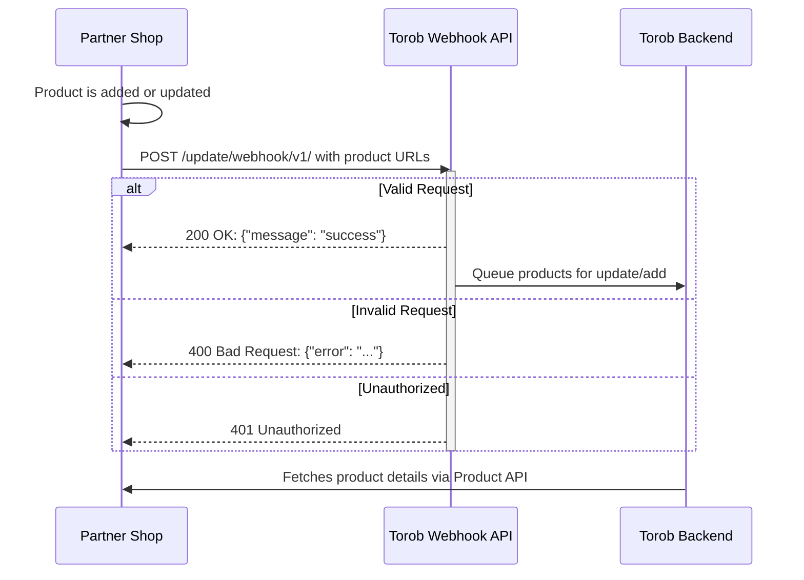

# Product Page Webhook: Implementation Guide
## Specification for the Product Update Webhook

## 0. Diagram



## 1. Introduction

This document outlines the technical requirements for using the Torob Product Webhook. Partners can use this webhook to notify Torob when products are added or updated, triggering faster sync without waiting for periodic crawls.

The webhook serves two purposes:
1. **Update existing products**: Notify Torob to refresh product information
2. **Add new products**: Queue new products for addition to Torob

## 2. Webhook Specification

### 2.1. Endpoint Details

- **URL**: `https://api.torob.com/update/webhook/v1/`
- **Method**: `POST`
- **Content-Type**: `application/json`
- **Authentication**: Bearer token in the `Authorization` header

### 2.2. Request Format

```json
{
  "items": [
    {
      "page_url": "https://domain.com/product/34/",
      "page_unique": "12412_1"
    },
    {
      "page_url": "https://domain.com/product/35/",
      "page_unique": "12412_2"
    }
  ]
}
```

**Parameter Details:**

| Parameter     | Type         | Required | Description |
| ------------- | ------------ | -------- | ----------- |
| `items`       | list[object] | Required | List of products (min: 1, max: 100 items) |
| `page_url`    | string       | Required | Product URL (must start with `http://` or `https://`) |
| `page_unique` | string       | Required | Unique product identifier |

### 2.3. Authentication

Include your Bearer token in the request header:

```
Authorization: Bearer <your_token>
```

Contact Torob support to obtain your token.

### 2.4. Response Format

#### Success Response (200 OK)
```json
{
  "message": "success"
}
```

> **Note**: A success response indicates the webhook received the data successfully. It does not mean the products have been updated/added yet - they are queued for processing.

#### Error Responses

**400 Bad Request** - Invalid input:
```json
{
  "error": "error message"
}
```

**401 Unauthorized** - Missing or invalid token

**403 Forbidden** - Domain mismatch:
```json
{
  "error": "Shop domain does not match the credentials given"
}
```

## 3. Important Notes

1. **Rate Limiting**: Maximum 20 requests per minute per shop. To avoid rate limiting, batch your products (up to 100 per request).

2. **Active Shops Only**: The webhook only processes requests for active shops.

3. **Product Status**: Products with problematic status (temporarily removed, permanently removed, etc.) will not be processed.

4. **Absolute URLs**: All `page_url` values must be absolute URLs starting with `http://` or `https://`.

5. **Same Domain**: All `page_url` values in a single request must be from the same domain.

## 4. Example Requests

### Valid Request

```bash
curl --header "Content-Type: application/json" \
     --header "Accept: application/json" \
     --header "Authorization: Bearer <token>" \
     --request POST \
     --data '{"items": [{"page_url": "https://domain.com/product/34/", "page_unique": "12412_1"}, {"page_url": "https://domain.com/product/35/", "page_unique": "12412_2"}]}' \
     "https://api.torob.com/update/webhook/v1/"
```

**Response (200 OK):**
```json
{
  "message": "success"
}
```

### Invalid Request - Mixed Domains

```bash
curl --header "Content-Type: application/json" \
     --header "Accept: application/json" \
     --header "Authorization: Bearer <token>" \
     --request POST \
     --data '{"items": [{"page_url": "https://domain.com/product/34/", "page_unique": "12412_1"}, {"page_url": "https://wrong-domain.com/product/35/", "page_unique": "12412_2"}]}' \
     "https://api.torob.com/update/webhook/v1/"
```

**Response (400 Bad Request):**
```json
{
  "error": "All page_urls must have the same host"
}
```
